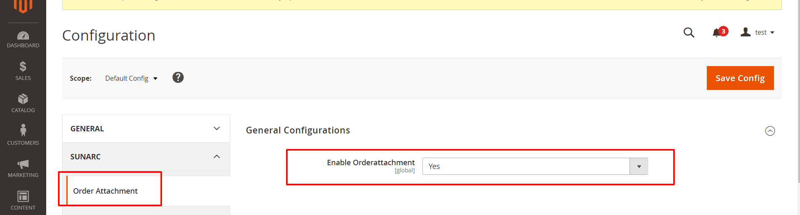
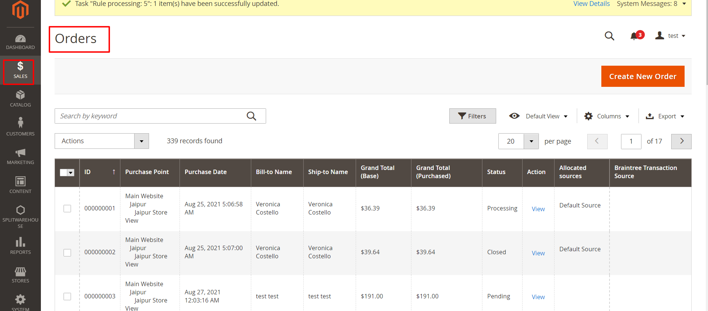
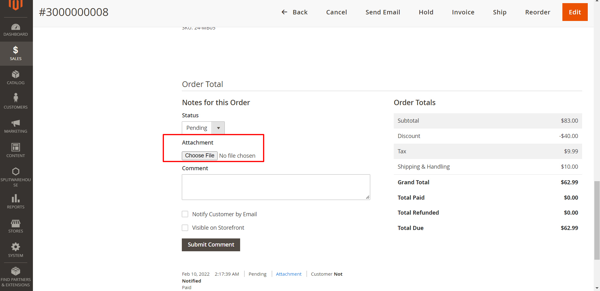
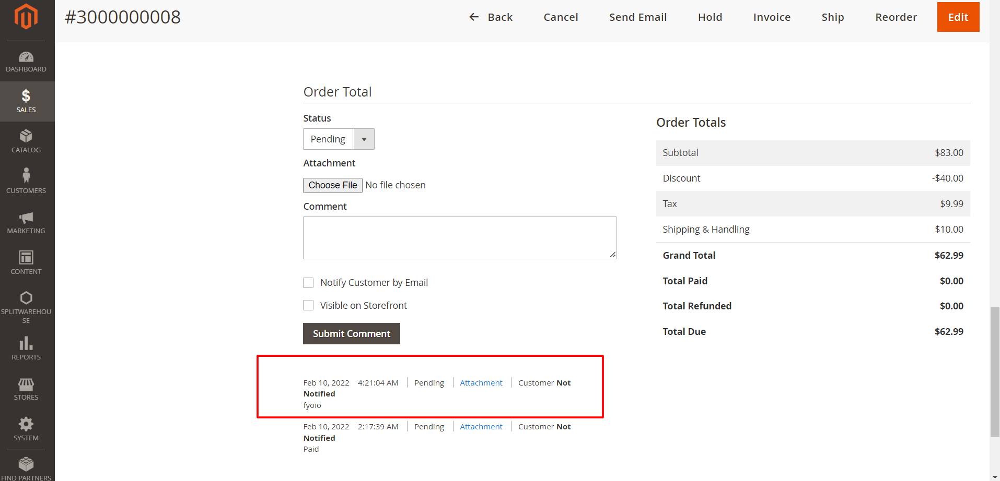
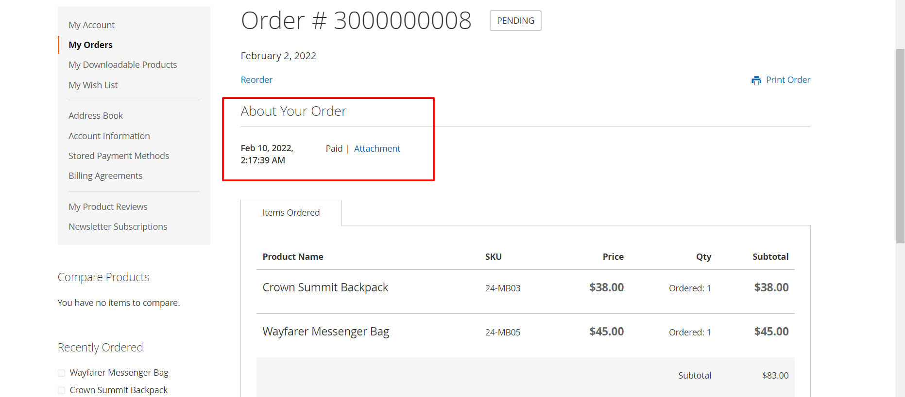

# Magento 2 Order Attachment Extension by Sunarc

This Extension is used to attach a reference image file in their order notes section for customer and store admin.

## Installation
Via Composer

```bash
composer require sunarctech/orderattachment
```
## Key Features
- This module helps us attach reference image files in the order notes section on the - admin side.
- Attachment will show in both frontend side and admin side.
- Easy to use and user friendly.

## Steps to use the Order Attachment

### **Step 1 :** Enable the extension
<br/>


<br/>
<br/>

### **Step 2 :** After the enable extension Go to order section
<br/>


<br/>
<br/>

### **Step 3 :** In the Magento order section choose any order and click on the action tab view of any order details. 
<br/>
After clicking on view go to respective order bottom page. 

You will find the attachment option to upload any reference image for order details. 

**Note:** This product supports attachment for image only.  
<br/>


<br/>
<br/>

### **Step 4.1 :**  After the attachment upload you can find the same attachment in their below side:
<br/>


<br/>
<br/>

### **Step 4.2 :**  Also you can find attachment in customer frontend side:
<br/>


<br/>
<br/>

## Extension Requirments
> Php Version
  - 5.5 - 8.0

> Magento Version
  - 2.1 to 2.4

## Created by SunArc Technologies
We are the leading Software Development Company providing end-to-end IT services & solutions to our esteemed customers in multiple industries and domains for the past 18+ years? Give us a call.

## Contact Us
Sometimes​ extension ​already installed​ ​on​ ​your​ ​store​ ​may​ ​conflict​ ​with​ ​the ​extension.​ ​If​ ​you​ ​run​ ​into an​ ​error​ ​we​ can help you 

> Please​ ​contact​ ​us​ ​at [Support Email](mailto:support@suncartstore.com)

## 🛒 Marketplace By SunArc Technologies 
We developed a broad range of Magento Extensions for E-Com merchants, The objective is to provide premium Extensions to increase the efficiency of the Magento E-stores
[Suncart Marketplace](https://www.suncartstore.com/)

## License
The OSL-3.0 & AFL-3.0 License. Please see [LICENSE](LICENSE) for more information.